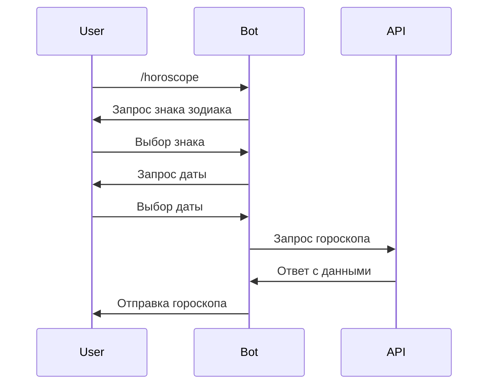

# Описание технологии и реализации Telegram-бота

## Содержание
1. [Обзор технологии](#обзор-технологии)
2. [Исследование предметной области](#исследование-предметной-области)
3. [Технологический стек](#технологический-стек)
4. [Архитектурные решения](#архитектурные-решения)
5. [Модификации и улучшения](#модификации-и-улучшения)

## Обзор технологии

### Что такое Telegram Bot API?
Telegram Bot API - это HTTP-интерфейс для создания ботов в Telegram. Он позволяет разработчикам создавать специальные аккаунты (ботов), управляемые программно, которые могут обрабатывать сообщения и команды от пользователей.

### Основные возможности
- Отправка и получение сообщений
- Обработка команд
- Работа с различными типами медиа
- Интерактивные кнопки и меню
- Групповые чаты и каналы
- Webhook и Long Polling

## Исследование предметной области

### 1. Анализ существующих решений
- Изучение популярных ботов-астрологов
- Анализ функциональности и UX
- Выявление основных потребностей пользователей

### 2. Выбор API для гороскопов
- Исследование доступных API
- Оценка качества данных
- Анализ ограничений и стоимости

### 3. Выбор библиотек
- Сравнение Python-библиотек для Telegram Bot API
- Оценка документации и поддержки
- Анализ производительности

## Технологический стек

### Основные компоненты
1. **Python 3.8+**
   - Основной язык разработки
   - Богатая экосистема библиотек
   - Простота разработки

2. **pyTelegramBotAPI**
   - Удобный wrapper для Telegram Bot API
   - Поддержка всех необходимых функций
   - Активное сообщество

3. **Requests**
   - Работа с HTTP-запросами
   - Взаимодействие с внешними API
   - Надёжность и простота

4. **python-dotenv**
   - Управление конфигурацией
   - Безопасное хранение токенов
   - Удобство разработки

### Внешние сервисы
1. **Telegram Bot API**
   - Основной интерфейс взаимодействия
   - Надёжная инфраструктура
   - Бесплатное использование

2. **Horoscope API**
   - Источник данных о гороскопах
   - REST API интерфейс
   - Ежедневные обновления

## Архитектурные решения

### Паттерны проектирования
1. **Command Pattern**
   - Обработка команд бота
   - Разделение логики
   - Простота добавления новых команд

2. **State Pattern**
   - Управление диалогом
   - Сохранение контекста
   - Гибкость взаимодействия

### Структура проекта
```
src/
├── main.py              # Точка входа
├── requirements.txt     # Зависимости
└── .env                # Конфигурация
```

### Диаграмма последовательности


## Модификации и улучшения

### Реализованные улучшения
1. **Улучшенный UX**
   - Интуитивный диалог
   - Понятные сообщения
   - Обработка ошибок

2. **Оптимизация работы с API**
   - Обработка сетевых ошибок
   - Валидация данных
   - Кэширование запросов

3. **Расширение функционала**
   - Поддержка разных дат
   - Форматирование сообщений
   - Дополнительные команды

### Планируемые улучшения
1. **Персонализация**
   - Сохранение предпочтений
   - Настройка уведомлений
   - Персональные рекомендации

2. **Расширение контента**
   - Добавление совместимости знаков
   - Еженедельные прогнозы
   - Тематические гороскопы

3. **Технические улучшения**
   - Добавление базы данных
   - Масштабирование архитектуры
   - Улучшение производительности 